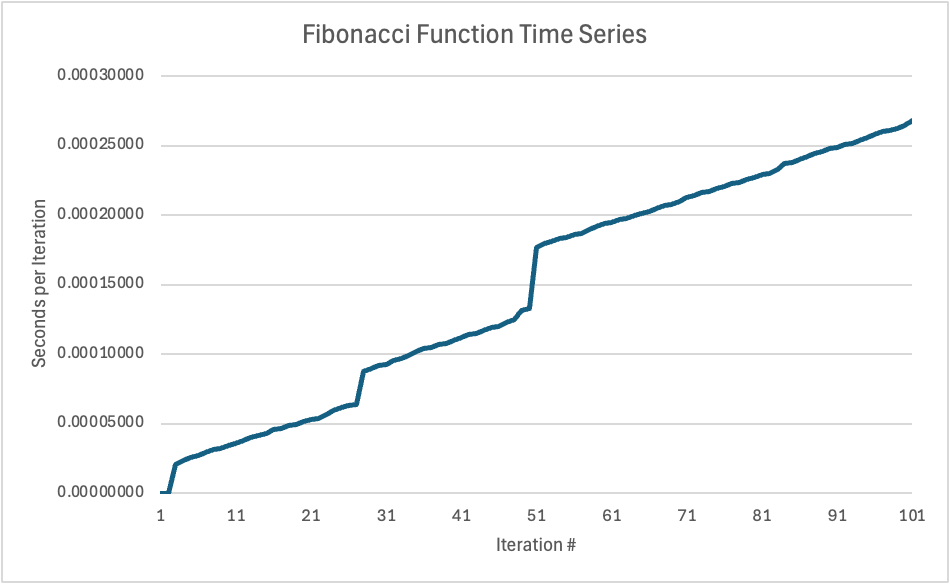

# Python-Web-Development-Assignment-1

### This is the first assignment for my Python Web Development class.

In this assignment, we were instructed to create two functions called **echo()** and **fib()**. 

**<ins>The specifications for echo are:</ins>** The method echo() has two input parameters: text is a string which represents what you yelled at a mountain; repetitions is an integer which represents the number of times that the mountain echoes your voice.
The method echo() returns a string which represents the echoed sound with fading effect.

**<ins>The specifications for fib are:</ins>** The method fib() will compute the nth Fibonacci number in a recursive manner. The calculation time will increase tremendously by increasing the value of n. We were also required to use decorators to implement the execution time series calculations. 

Here is a graph displaying the time in seconds each iteration of fib.py took for 100 iterations:

The x-axis represents the n in Fibonacci number calculation, and the y-axis represents the time in seconds each execution took.
